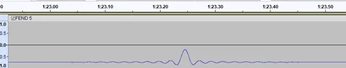
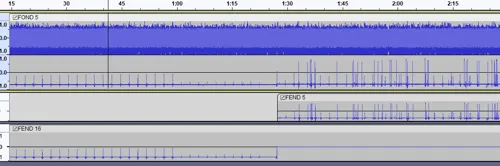
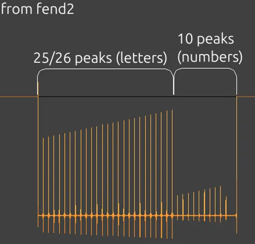

# FEND

FEND is a series posted to the [second YouTube account](Real_and_Fake_channels) between May 26 and June 4, 2016. There are 20 videos in the series (numbered 0 to 19).

## Details
Through videos all have an identical length of 27:46, for a total of about 50,000 frames per video.

The composites made from the videos are generally color gradients.

## 2D composite
This composite by Tomas F is a long image with several colored bars:

It is worth noting that one section near the beginning of the combined gradient composite had an "island" like object in it:

Detail from ♐FEND 2D composite showing "island"-type object:

## 3D composite
This 3D composite by Tomas F is several planes crossing through each other with some mountain-like shapes, http://tomasf.se/projects/semi/stl.html?path=FEND_composite3D.stl.

♐FEND 3D composite, view #1:

♐FEND 3D composite, view #2:

## Audio
The audio in the FEND videos (at least so far) can be divided into three sub-groups. The sub-groups can be distinguished by their identical audio content.

Subgroup A is identified by a \~2s. scratching-type noise. Members of subgroup A: 0, 1, 3, 6, 8, 13, 15.

Subgroup B is identified by a \~1:27 "heartbeat" sound with a large DC offset (\~ -.749). Members of subgroup B: 2, 4, 10, 11, 16, 17.

Subgroup C is identified by a \~20:18 throb/rumble sound with a large DC offset (\~-.7275). Members of subgroup C: 5, 7, 9, 12, 14.

### Method of testing for audio similarity
For each of the groups, /u/Unfavorablist opened two separate FEND sound tracks in [Audacity](http://www.audacityteam.org/download/). /u/Unfavorablist then inverted one and did a mix. Identical but inverted tracks should cancel each other out perfectly, as these did.

## Reversing audio
On 2026-02 user Ben's Fractals reports:
> FEND 1's audio seems to be reversing back and forth.
>
> See how it mirrors horizontally.
>
> In case you think this is some spectral error you can even see the wave-forms flipping.
>
> One thing this reminds me of is Recycle which was a drum slicing program from the 90s. As a cheap method to do tail-extension for drums the audio would reverse back-and-forth as a ping-pong loop at the end of a segment and create these mirrored patterns.

## Flip noise
In 2026-02 N25 CT13 writes:
> I did find this exact wave form and other similar "flip" in FEND 1's audio. It's at the end part of the quiet scratching at the beginning.
>
> You have to amplify the audio quite a bit to be able to see this.
>
> I kind of feel that it could be noise and some kind of "audio encoding artifact".

## Sinc impulse
> ben's fractals: these waveforms on FEND subgroup B and C are sinc impulses, https://en.wikipedia.org/wiki/Sinc_function
> 
> This probably means that the audio was resampled from a really low sample rate back to 44100hz

## Relation to Fond
> ben's fractals: Fond and Fend are related audio wise
>
> In the right channel of FOND 5 you can see it transition from FEND subgroup B to FEND subgroup C

> N25_CT13: the repeating beginning section has 25/26 big peaks (first one possibly cut off at the start) and 10 small peaks
> 
> it could be letters and numbers in order (A to Z; 0 to9) being put there as peaks to refer to as an alphabet when reading the more random section of peaks

